# THEY ARE COMING
### A gritty 2D top-down zombie survival shooter — made with Claude

A fully playable, browser-based zombie survival shooter with deep equipment,
a shop, a suit-up loadout stage, traps, turrets, multiple zombie types, bosses,
procedural pixel-art, dynamic lighting, and procedural audio. Survival-horror
tension meets twin-stick arcade energy — a richer, more customizable take on
*They Are Coming*.

> Read the full design bible in **[CONCEPT.md](CONCEPT.md)**.

---

## ▶ Play it live

**https://shuva18325.github.io/THEY-ARE-COMING/** — runs right in the browser.
*(Left-click = melee/stab, Right-click = shoot, WASD = move.)*

## 📸 Screenshots

| Samurai armor + RPG + a **pet tiger** | Pets shop (K-9 / bear / tiger / drone) | RPG rocket + pet in combat |
|---|---|---|
| 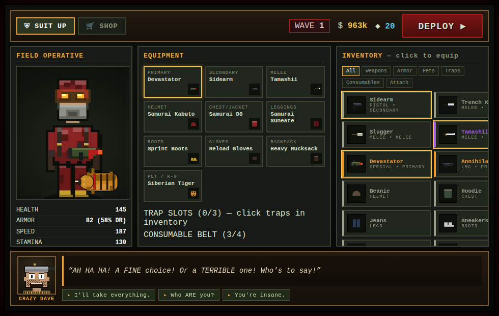 | 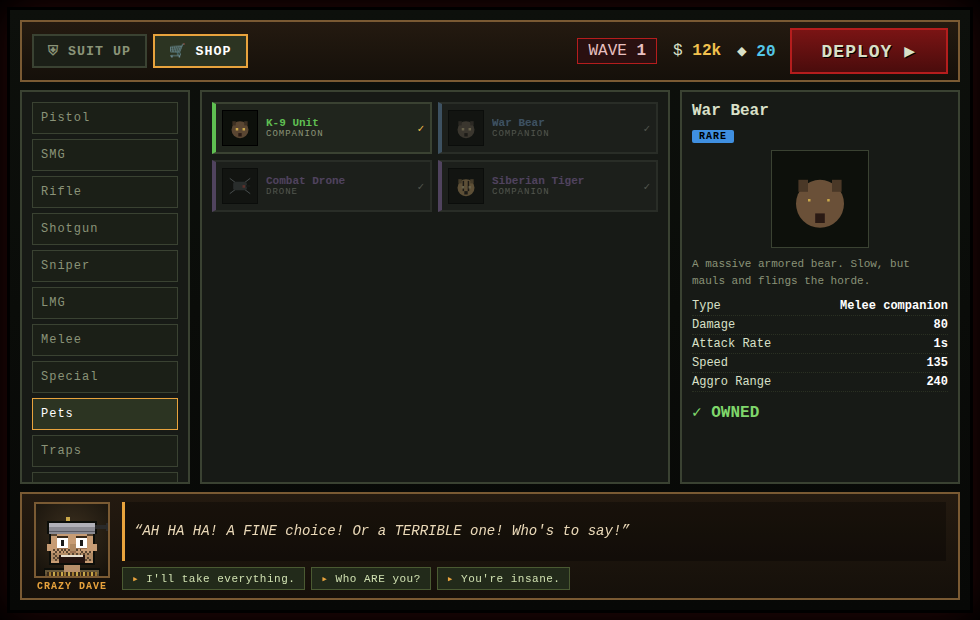 | 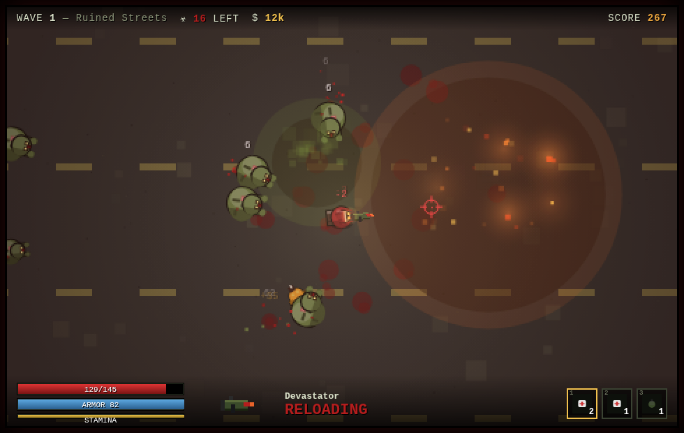 |

| The survivor & **Crazy Dave** (shop merchant) | Detailed zombies |
|---|---|
| 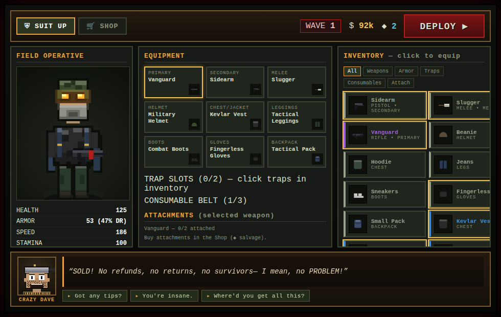 | 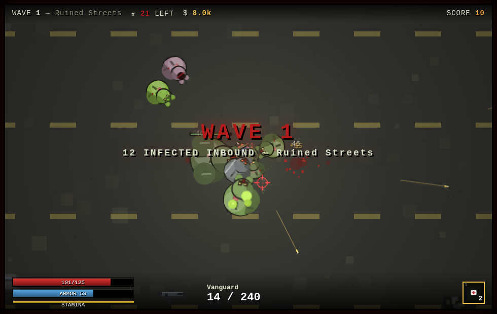 |

The protagonist is drawn to match the gritty reference art — camo knit helmet,
glowing orange goggles, gas mask, ragged camo jacket, blue pack — and every gear
slot redraws him. **Crazy Dave** lives by the shop with branching banter ("I can
make you SURVIVE... for a price"); click a reply to talk back.

| Title screen | Shop (with unlock-gated stock) | Combat — muzzle flash & tracers |
|---|---|---|
| 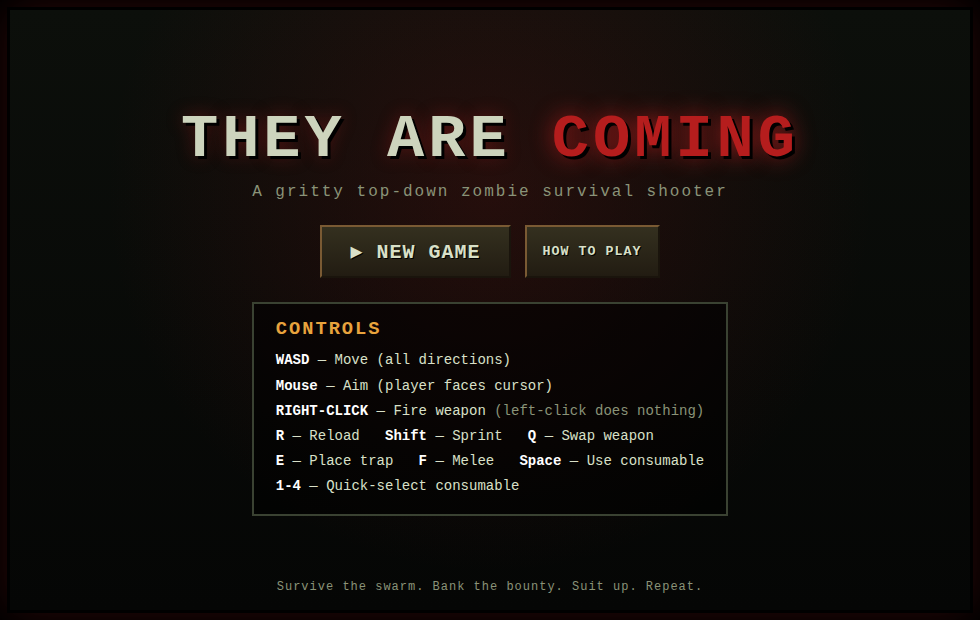 | 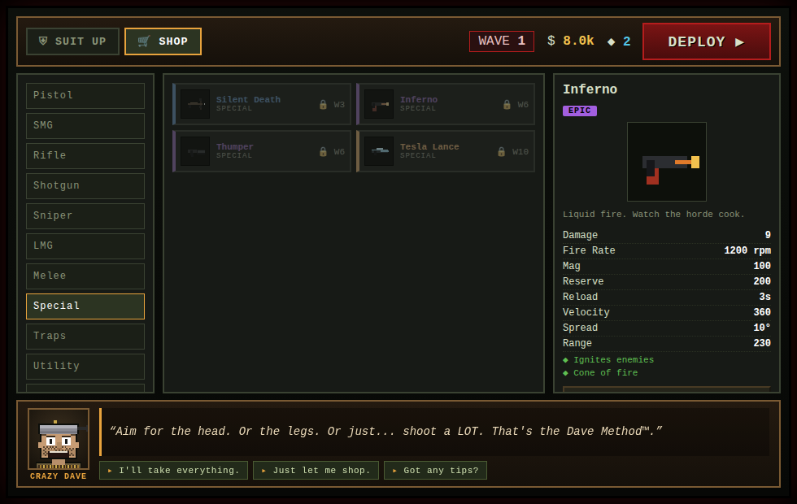 | 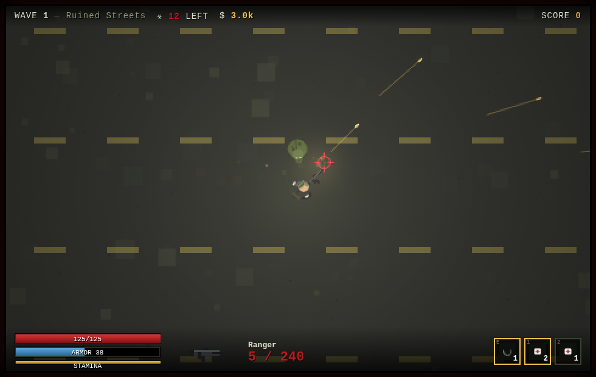 |

| Night battle (fire + toxic) | Boss wave — The Behemoth | Wave cleared |
|---|---|---|
| 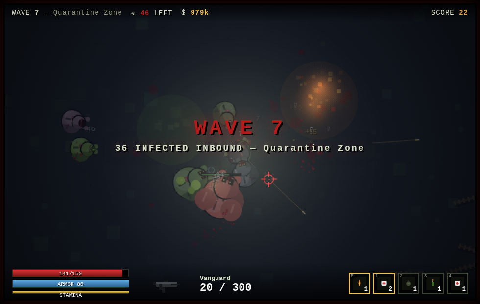 | 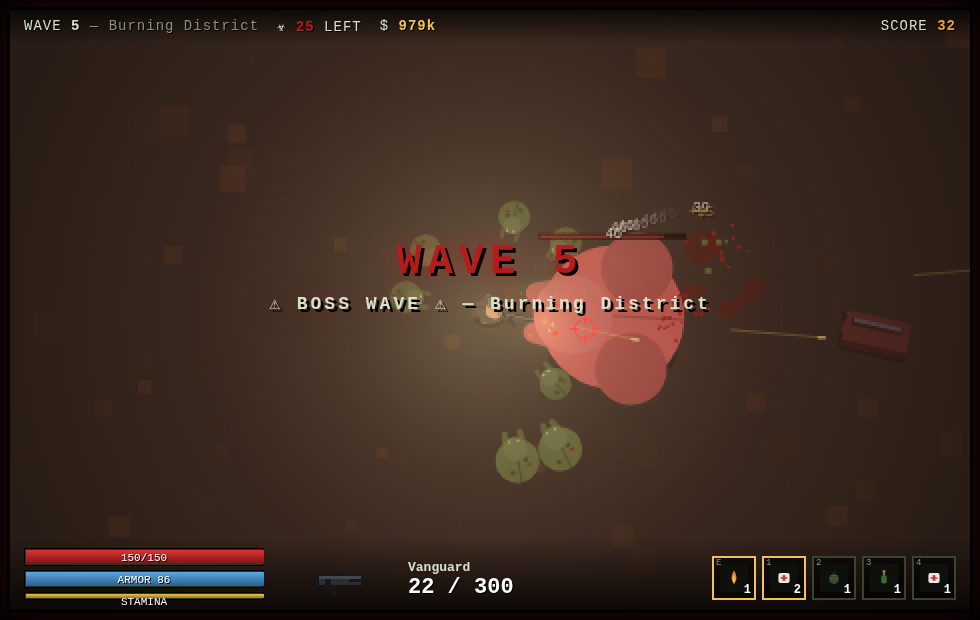 | 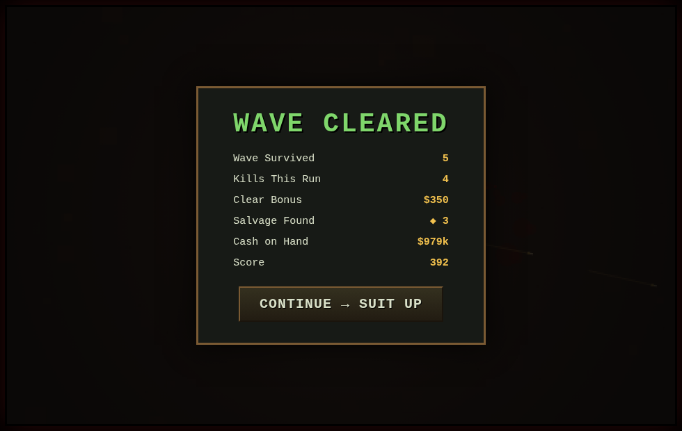 |

---

## ▶ Run it

No build step. It's plain HTML5 + Canvas + vanilla JS.

```bash
cd THEY-ARE-COMING
python3 -m http.server 8000
# open http://localhost:8000  in a browser
```

(Or just open `index.html` directly — a local server is only recommended so
audio unlocks cleanly.)

---

## 🎮 Controls

| Input | Action |
|---|---|
| **WASD** | Move in all directions |
| **Mouse** | Aim — the operative always faces the cursor |
| **LEFT-CLICK** | **Melee / stab** (your equipped melee weapon) |
| **RIGHT-CLICK** | **Fire the weapon** (hold for automatics) |
| **R** | Reload |
| **Shift** | Sprint (drains stamina) |
| **Q** | Swap primary / secondary |
| **E** | Place trap / turret |
| **F** | Melee swing |
| **Space** | Use selected consumable |
| **1–4** | Select consumable on belt |

---

## 🩸 What's in it

- **Core loop:** Suit Up → Deploy → survive the wave → bank the bounty → shop & upgrade → repeat. Boss wave every 5th wave.
- **Firing feel:** bright yellow muzzle flash, visible pixel-art projectiles with tracers, blood bursts, armor sparks & ricochets, wall debris, screen shake, recoil kick, shell ejection, procedural gunshots.
- **24 weapons** across 8 families (pistols, SMGs, rifles, shotguns, snipers, LMGs, melee, specials incl. flamethrower / crossbow / grenade launcher / railgun) — each with a procedurally drawn sprite and tuned fire profile.
- **9 traps & turrets**, **7 consumables/utility**, **20+ armor pieces** across 6 slots that visibly redraw the player sprite, and **8 weapon attachments** bought with salvage.
- **5 rarity tiers** with color-coded frames and scaled stats.
- **11 zombie archetypes + 2 bosses** with distinct stats, sprites, and abilities (deflecting armor, exploding bloaters, summoning screamers, acid spitters, lunging dogs, night stalkers, child-birthing boss…).
- **7 environments** with **Day / Sunset / Night / Fog** lighting, fog, fire, smoke, crashed cars, barriers, and persistent blood/scorch decals.
- **Full Shop + Suit-Up/Loadout UI** with live character preview, gear stats, attachments, and trap/consumable slots.

## Project layout

```
index.html        screens + canvas
css/style.css     gritty pixel UI
js/utils.js       math / helpers / rarity
js/data.js        catalogs: weapons, zombies, traps, items, armor, environments
js/sprites.js     procedural pixel-art (guns, player, zombies, icons)
js/audio.js       procedural WebAudio SFX
js/input.js       WASD + mouse (right-click fires)
js/particles.js   particles, lights, decals, screen shake
js/entities.js    Player, Zombie, Bullet, Trap, Turret, Throwable, Hazard
js/ui.js          menu, shop, loadout, HUD
js/game.js        state machine, wave director, renderer, lighting
```

Made with Claude. See [CONCEPT.md](CONCEPT.md) for the complete vision.
